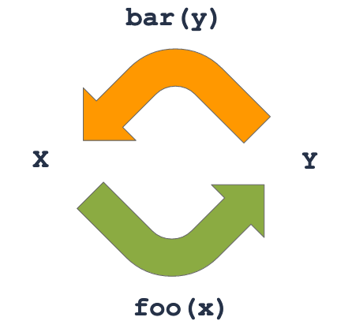
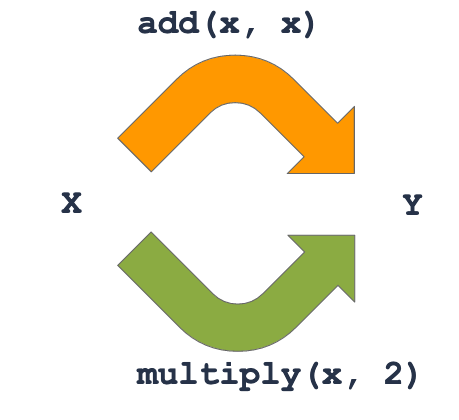
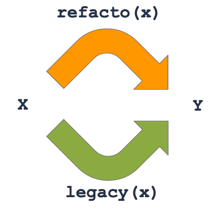
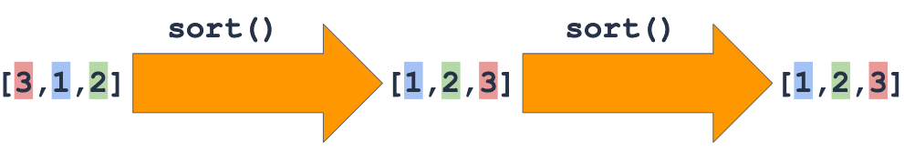
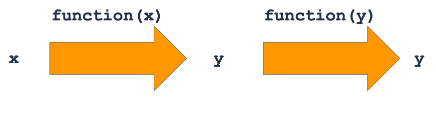

# Troll of Fame - ReasonML training

This project use [ReasonML](https://reasonml.github.io) with [esy](https://esy.sh/) workflow and [Dune](https://github.com/ocaml/dune) build system.

## Getting started

- Install esy : `npm install -g esy`
- Install dependencies : `esy`
- Work with your IDE (VSCode - recommended, VIM, Emacs ) : `esy x [MY_IDE]` ie `esy x code .`
- Run compiled executable : `esy x Fame`
- Run tests : `esy x Runner`

Nota Bene : If you're using VS Code, you should install [OCaml and Reason IDE](https://marketplace.visualstudio.com/items?itemName=freebroccolo.reasonml) and enable the parameter _Reason › Codelens: Enabled_

## Once upon a time ...

The King of the Trolls Gnonpom coded the **Troll of Fame** : a wonderfull application that would help Trolls to learn numbers when they are hunting.
Gnonpom was a hard skilled Test Driven Developer king who just released **ToF** when all tests passed Green.

Sadly he was shooted by a disgusting Elf.

Here come a new King, Hurrah for the great Troll Aklass!

This time it's decided, the elf hunting contest is launched!

At the end of each battle, the trolls want to compare the number and attributes of the slain elves. And with **ToF** it will be easy ... maybe.

## Excercices

### Work with legacy code

You inherit an application that seems to work fine. Run `esy x Runner` (•̀ᴗ•́)و ̑̑

Read [Elf_test.re](./test/lib/Elf_test.re) and [Troll_test.re](./test/lib/Troll_test.re) as a first specification of the software.

Now uncomment the content of [Elf_prop.re](./test/lib/Elf_prop.re) and run tests again `esy x Runner`... Ooops seems that our unit tests was not so complete. (╥﹏╥)

We will try to improve the quality of _Troll of Frame_ thanks to Property Based Testing

### Property testing

Property Based Testing (a.k.a. PBT) is about generating tests instead of manually writing them. Unlike unit tests where you know what goes in and what comes out (a.k.a. oracle tests), you assess properties that should always be true. The PBT library checks for arbitrary inputs that the property is true.

In ReasonML, we use `qcheck-rely` library to write and run Property Based tests.

#### Step 1 - Configuration and Invariance


- For a simpler start, we already configured the build dependencies and created generators for `Elf` and `Troll` in the test lib.
- PBT tests are located in [Elf_prop.re](./test/lib/Elf_prop.re) and [Troll_prop.re](./test/lib/Troll_prop.re)

```OCaml
open Framework;
open QCheckRely;
open Lib.Elf;

/* Elf Generator */
let elf_arbitratry =
  QCheck.Gen.(
    pair(
      oneofl([Swordsman, Archer, Warlock, Priest]),
      oneofl([HighElf, DarkElf]),
    )
    >|= (pair => from_pair(pair))
  )
  |> QCheck.make;

let {describe} = extendDescribe(QCheckRely.Matchers.matchers);

/* Porperties Based Tests */
describe("Elf Invariance", ({test}) => {
  test("Elf value should always be positive", ({expect}) => {
    QCheck.Test.make(
      ~count=1000,
      ~name="elf value should always be positive",
      elf_arbitratry,
      elf =>
      value(elf) > 0
    )
    |> expect.ext.qCheckTest;
    ();
  })
});
```

- Did you notice the property test takes a `Elf.t` as input? That's where PBT shines! The library will run this test 1000 times, and each time will pass a random Elf to it. We no longer care about building input data!

- The first property test we will write aims to assess Invariance property: it means a property should always be true even if the input varies (e.g. the Elf)

- As an example, no matter the elf, his value is always > 0.

- Another exemple, an elf value is always the product of his role value and his race value. That's the test which made you discover a bug when you uncommented it while our unit tests were _PASS_!

- As first exercice, implement an invariant Test for a `Troll`. No matter the troll, his score is always >= 0 (i.e. is never negative).

- What would the same check with regular unit tests look like?

> 📌 Most unit tests can actually be converted to **Invariance properties**

#### Step 2 - Inverse

Inverse properties check that it's possible to transform some input to an output and back to the original input, no matter the input. This is a useful property because it guarantees some functions don't lose information and/or are consistent.



- For any `Troll` and any `Elf`, if the `Troll` kills the `Elf` and then realizes the elf survived, what should be the result?
- Write an inverse property test to check that

Testing it will ensure that `i_got_one` and `oops_he_survived` are consistent.

#### Step 3 - Analogy

Analogous properties check that there are at least 2 different ways from any input to reach an output. This is a useful property because it guarantees some functions are consistent (can also be useful for refactors)



For any troll, any elf and any positive quantity of killed elves, what should be the difference between:

- killing a single elf and repeating this operation quantity times
- killing in a single strike quantity units of elf?

Write an analogous property test to check that

This ensures that `i_got_one` and `i_got` are consistent.



#### Step 4 - Idempotence

Idempotent properties check that running a function once or several times leads to exactly the same result, i.e. an idempotent function brings to a stable state from which this function becomes useless.



- For any `Troll` and any `Elf`, once all elves have been resurrected, what should happen if these elves are resurrected again?
- Write an idempotent property test to check that



This ensures that `all_elves_of_a_kind_resurrected` brings the `Troll` killing list to a stable state (i.e. many call should have the same result as once).

#### [Bonus] Step 5 - Metamorphism

Metamorphic properties check that running a function with variants of the same input should lead to equal or consistent outputs. E.g. if the input is multiplied by 2, is the output also multiplied by 2? Divided by 2? The same?

- For any `Troll` and any elf, what should the `Troll` score be compared to the score of the `Troll` after killing elf?
- Write a metamorphic property test to check that

This ensures that i_got_one correctly increases the kill list (and thus the score) when an elf is killed.

#### [Bonus] Step 6 - Injection

Injective properties check that different inputs lead to different outputs, i.e. there aren't 2 different inputs that lead to the same output, i.e. each output has at most 1 input.

- For any `Troll` and any 2 elves elf1 and elf2, assuming elf1 is different from elf2, troll after killing elf1 must be different from `Troll` after killing elf2
- Write an injective property test to check that

This ensures that iGotOne always updates the provided `Troll` in a unique way.
